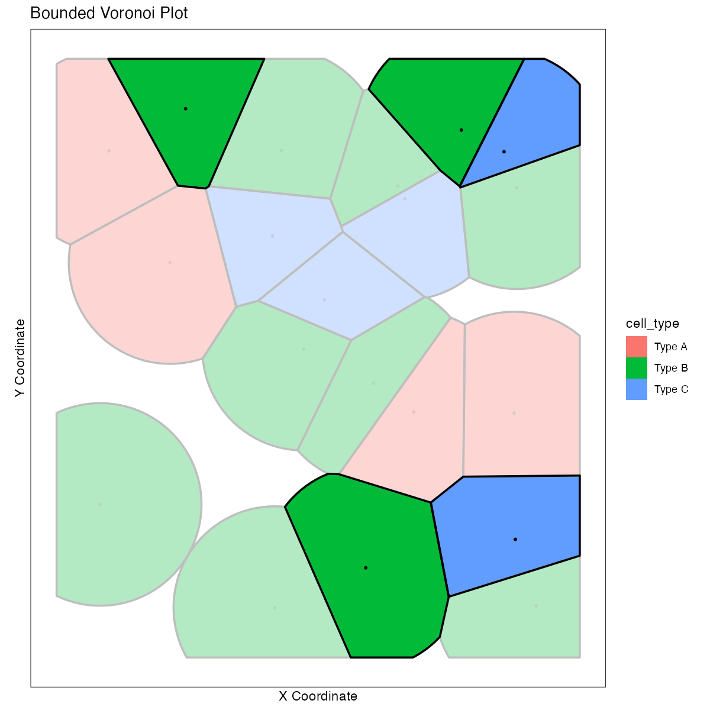
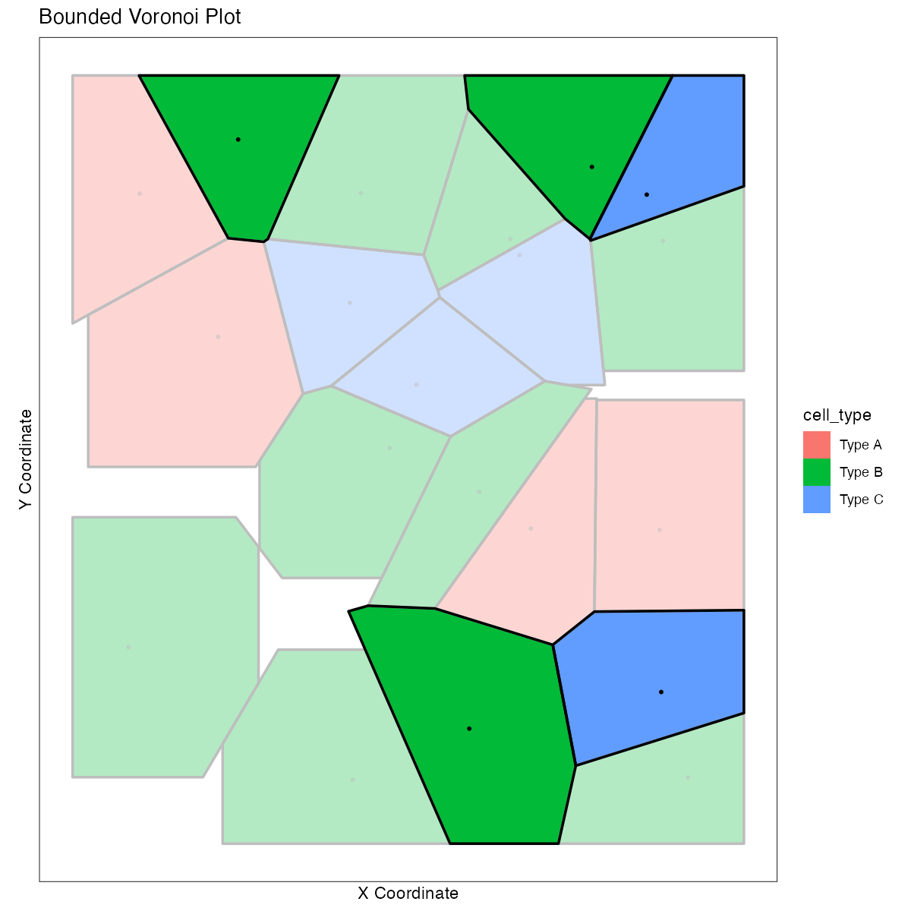
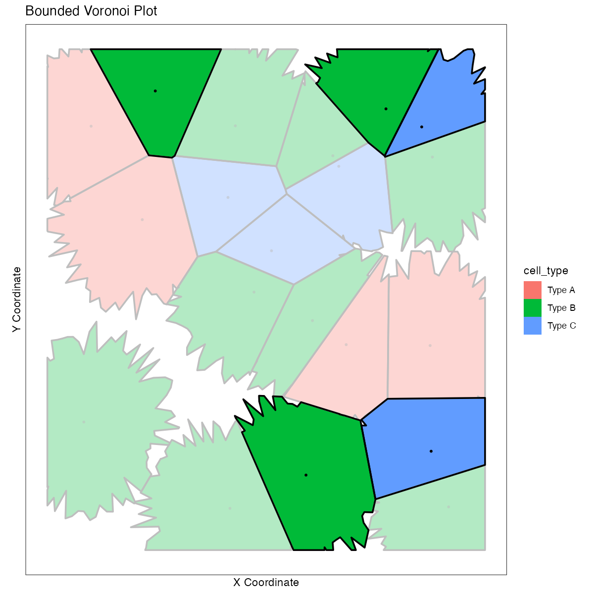

# Bounded Voronoi Plot Generator for R

This R script provides a flexible function to generate bounded Voronoi diagrams for spatial datasets. Unlike standard Voronoi plots, this implementation creates "cell-like" structures by clipping the Voronoi polygons to a maximum radius around each point. This is ideal for visualizing spatial data where clusters of points form distinct regions, such as in cell biology or geographic analysis.

## Features

*   **Bounded Polygons:** Voronoi cells are clipped to a maximum radius, preventing infinite cells and creating a more "cellular" appearance.
*   **Customizable Shapes:** Choose from three different clipping shapes:
    *   `"circle"`: For rounded cell boundaries.
    *   `"square"`: For sharp, geometric cell boundaries.
    *   `"cell"`: For an organic, irregular cell boundary.
*   **Comprehensive Highlighting:** A boolean flag in the data can be used to highlight specific cells, affecting the opacity and border color of the cell fill, as well as the appearance of the central point.
*   **Flexible Data Mapping:** Customize the column names for coordinates, cell types, and highlighting.
*   **Custom Color Palettes:** Provide your own named vector of colors to style the plot.

## Example Plots

Below are examples of the three different clipping shapes available.

### Shape: "circle"


### Shape: "square"


### Shape: "cell"


## Installation

You can install the `VoronoiPlotter` package directly from GitHub using the `remotes` package:

```R
# Install the 'remotes' package if you haven't already
# install.packages("remotes")

# Install VoronoiPlotter from GitHub
remotes::install_github("heoly32/VoronoiPlotter")
```

## Usage

1.  Load the `VoronoiPlotter` package into your R session.
2.  Prepare your data in a `data.frame`.
3.  Call the `generate_voronoi_plot()` function with your data and desired parameters.

```R
library(VoronoiPlotter)

# Create some sample data
my_data <- data.frame(
  X_Coord = runif(50, 0, 100),
  Y_Coord = runif(50, 0, 100),
  Cell_Group = sample(c("Group 1", "Group 2", "Group 3"), 50, replace = TRUE),
  Is_Special = sample(c(TRUE, FALSE), 50, replace = TRUE, prob = c(0.1, 0.9))
)

# Generate the plot
my_plot <- generate_voronoi_plot(
  data = my_data,
  radius_limit = 15,
  shape = "cell",
  point_size = 2,
  x_col = "X_Coord",
  y_col = "Y_Coord",
  color_col = "Cell_Group",
  highlight_col = "Is_Special"
)

# Display the plot
print(my_plot)

# Save the plot
# ggsave("my_voronoi_plot.png", plot = my_plot, width = 8, height = 8)
```

## Function Parameters

`generate_voronoi_plot(data, radius_limit, shape, point_size, col_palette, x_col, y_col, color_col, highlight_col, opacity)`

| Parameter       | Description                                                                                              | Default Value |
|-----------------|----------------------------------------------------------------------------------------------------------|---------------|
| `data`          | A `data.frame` containing the plotting data.                                                             | (Required)    |
| `radius_limit`  | The maximum radius (or half side-length for squares) for the clipping shape. Defaults to 15.            | `15`          |
| `shape`         | The clipping shape. One of `"circle"`, `"square"`, or `"cell"`.                                            | `"circle"`    |
| `point_size`    | The size of the central points.                                                                          | `2`           |
| `col_palette`   | A named vector for custom cell colors, e.g., `c("Type1" = "red", "Type2" = "#00FF00")`. If `NULL`, uses ggplot's default palette. | `NULL`        |
| `x_col`         | The name of the column in `data` containing X coordinates.                                                 | `"x"`         |
| `y_col`         | The name of the column in `data` containing Y coordinates.                                                 | `"y"`         |
| `color_col`     | The name of the column in `data` used for coloring the cells.                                              | `"cell_type"` |
| `highlight_col` | The name of the logical (`TRUE`/`FALSE`) column in `data` used for highlighting cells.                     | `"highlighted"`|
| `opacity`       | The opacity (0 to 1) of non-highlighted cells. Highlighted cells are always fully opaque (1.0).            | `0.3`         |
